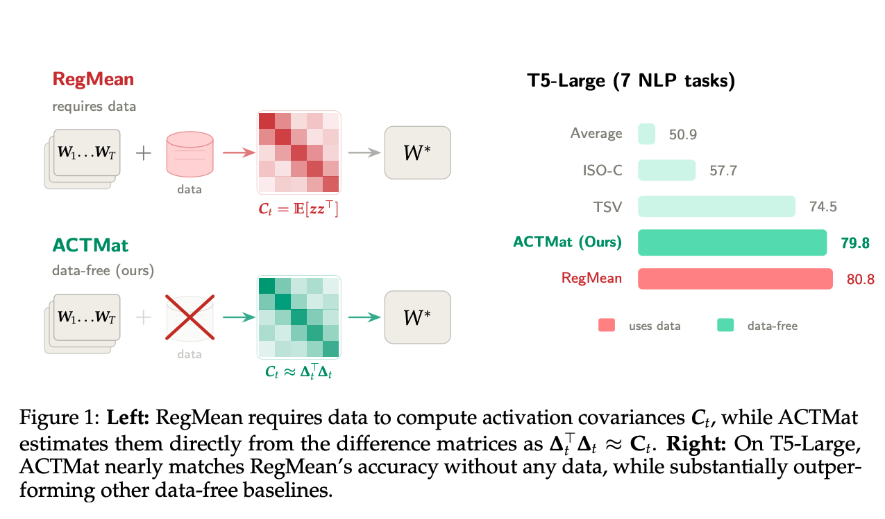

# ACTMat

This is the source code to reproduce the experiments of the paper [Model Merging via Data-Free Covariance Estimation](https://arxiv.org/pdf/2604.01329).

<p align="center">
  
</p>


## Setup

> **Note:** Vision/language and OLMo environments conflict, so separate venvs are used.

```sh
# Clone the repository (with submodules)
git clone --recurse-submodules git@github.com:marawangamal/actmat.git
cd actmat

# If you already cloned without submodules, initialize them with:
#   git submodule update --init --recursive

# Vision & language experiments
UV_PROJECT_ENVIRONMENT=.venv-vl uv sync --group vision-language

# OLMo experiments
UV_PROJECT_ENVIRONMENT=.venv-olmo uv sync --group olmo

# Set env vars
export PYTHONPATH="$PYTHONPATH:$(pwd)" # Add src to python path
export HF_HOME=$SCRATCH/huggingface
export NLTK_DATA=$SCRATCH/nltk_data
```

## Data

Download `data.tar.gz` (~36 GB extracted) — contains vision (Cars, DTD, EuroSAT, GTSRB, MNIST, RESISC45, SUN397, SVHN) and language (`story_cloze`) data — and unpack it into `data/`:

```sh
mkdir -p downloads
uvx gdown <URL> -O downloads/data.tar.gz   # download archive into downloads/
tar -xzvf downloads/data.tar.gz        # produces data/vision/ and data/language/
```

Then pass `--data-location=data/vision` to the vision scripts. On SLURM, the driver scripts copy `downloads/data.tar.gz` to `$SLURM_TMPDIR/` and extract there instead.

OLMo datasets are pulled from the HuggingFace Hub at runtime — just make sure `HF_HOME=$SCRATCH/huggingface` is set (see Setup).


## Vision Experiments (ViT-B-16 / ViT-B-32 / ViT-L-14)

```sh
# 1. Download checkpoints
uvx gdown 1KPFLGzz4zK5O7-ta8TIq0V4XyO16Jn1c -O checkpoints # or finetune using bash scripts/vision/finetune.sh
# 2. (Optional) Evaluate experts
bash scripts/vision/eval_single_task.sh
# 3. Evaluate merged models
bash scripts/vision/eval_task_addition.sh
```

Results are saved to `artifacts/results/{model}-{method}/metrics.json`.

## Language Experiments (T5-Base / T5-Large)

```sh
# 1. Download checkpoints
uvx gdown 1KPFLGzz4zK5O7-ta8TIq0V4XyO16Jn1c -O checkpoints # or finetune using bash scripts/language/finetune.sh
# 2. (Optional) Evaluate experts
bash scripts/language/eval_single_task.sh
# 3. Evaluate merged models
bash scripts/language/eval_task_addition.sh
```

Results are saved to `artifacts/results/{model}-{method}/metrics.json`.

## OLMo Experiments (Olmo-3-7b)

```sh
# 1. Download checkpoints
bash scripts/olmo/download_models.sh
# 2. (Optional) Evaluate experts
bash scripts/olmo/eval_single_task.sh
# 3. Evaluate merged models
bash scripts/olmo/eval_task_addition.sh # (default gpus: 4)
```


## Reproducing Plots
See [analysis.ipynb](analysis.ipynb) notebook.

