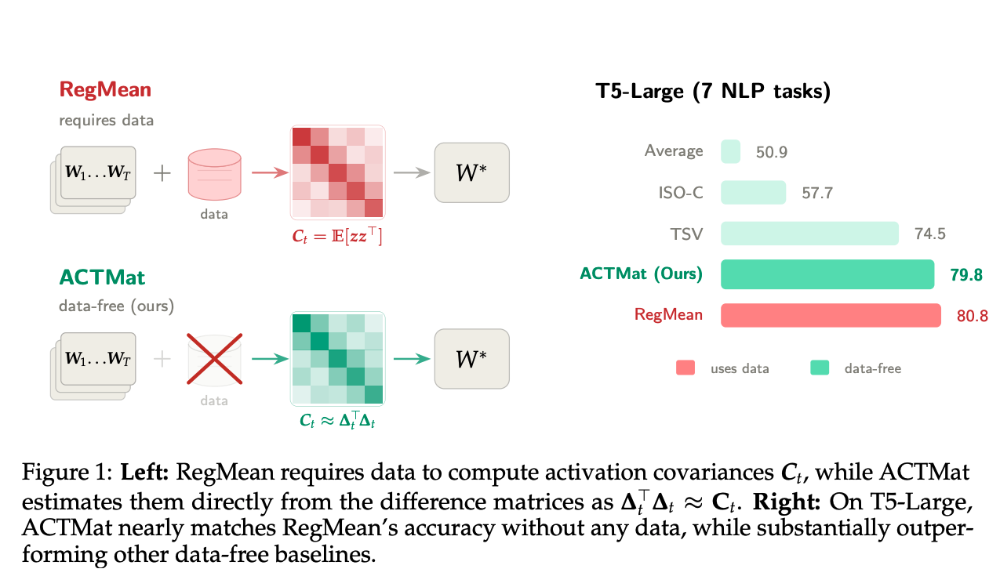

# ACTMat

This is the source code to reproduce the experiments of the paper [Model Merging via Data-Free Covariance Estimation](https://arxiv.org/pdf/2604.01329).

<p align="center">
  
</p>


## Setup

> **Note:** Each experiment uses it's own uv environment

```sh
# Clone the repository (with submodules)
git clone --recurse-submodules git@github.com:marawangamal/actmat.git
cd actmat

# Set env vars
export PYTHONPATH="$PYTHONPATH:$(pwd)" # Add src to python path
export HF_HOME=$SCRATCH/huggingface
export NLTK_DATA=$SCRATCH/nltk_data

# Download data & ckpts
# NOTE: you might need rclone to download this
gdown --folder https://drive.google.com/drive/u/4/folders/1Vc-cGalI9bE5M099x6t4XqGTN-YkQ0Lf -O ./downloads
# extract all to artifacts/
mkdir -p artifacts && for f in downloads/*.tar.gz downloads/*.tgz; do [ -e "$f" ] && tar -xzvf "$f" -C artifacts; done
```


## Vision Experiments (ViT-B-16 / ViT-B-32 / ViT-L-14)

```sh
# 0. Setup env
UV_PROJECT_ENVIRONMENT=.venv-vl uv sync --group vision-language
# 1. (Optional) Finetune models (ckpts can be downloaded as described in setup)
NUM_TASKS=8 FT_MODE=fft MODEL=ViT-B-16 sbatch --array=0-7 scripts/vit/finetune.sh
# 1b. (Optional) Generate covariance files if they are not in the checkpoints
NUM_TASKS=8 FT_MODE=fft MODEL=ViT-B-16 sbatch --array=0-7 scripts/vit/covariance.sh
# 2a. Evaluate experts        (NUM_TASKS=8|14|20 selects the suite)
NUM_TASKS=8 FT_MODE=fft MODEL=ViT-B-16 sbatch scripts/vit/eval_experts.sh
# 2b. Evaluate pretrained ViTs with the explicit-path wrapper
SINGLE_DIR=pretrained NUM_TASKS=8 FT_MODE=fft MODEL=ViT-B-16 sbatch scripts/vit/eval_single.sh
# 3a. Evaluate merged models  (NUM_TASKS=8|14|20 selects the suite)
METHODS="tsv isoc actmat regmean" NUM_TASKS=8 FT_MODE=fft MODEL=ViT-B-16 sbatch --array=0-3 scripts/vit/eval_merged.sh
METHODS="actmat actmat_w" NUM_TASKS=8 FT_MODE=fft MODEL=ViT-B-16 sbatch --array=0-3 scripts/vit/eval_merged.sh
# 3b. Evaluate merged models (packed qkv, actmat performs better on this)
NUM_TASKS=8 FT_MODE=fft MODEL=ViT-B-16 sbatch scripts/vit/eval_merged_packed.sh
```

Results land under `artifacts/results/{model}/group-{ft_mode}-{num_tasks}/...`.

## Language Experiments (T5-Base / T5-Large)

```sh
# 0. Setup env
UV_PROJECT_ENVIRONMENT=.venv-vl uv sync --group vision-language
# 1. (Optional) Finetune models (ckpts can be downloaded as described in setup)
NUM_TASKS=7 FT_MODE=fft MODEL=t5-base sbatch --array=0-6 scripts/t5/finetune.sh
# 1b. (Optional) Generate covariance files if they are not in the checkpoints
NUM_TASKS=7 FT_MODE=fft MODEL=t5-base sbatch --array=0-6 scripts/t5/covariance.sh
# 2. Evaluate experts
NUM_TASKS=7 FT_MODE=fft MODEL=t5-base sbatch scripts/t5/eval_experts.sh
# 2b. Evaluate pretrained T5 with the explicit-path wrapper
SINGLE_DIR=pretrained NUM_TASKS=7 FT_MODE=fft MODEL=t5-base sbatch scripts/t5/eval_single.sh
# 3. Evaluate merged models
METHODS="tsv isoc actmat regmean" NUM_TASKS=7 FT_MODE=fft MODEL=t5-base sbatch --array=0-3 scripts/t5/eval_merged.sh
```

Results land under `artifacts/results/{model}/group-{ft_mode}-{num_tasks}/...`.

## RL Zero Experiments (OLMo-3-7B)

```sh
# 0. Setup env
UV_PROJECT_ENVIRONMENT=.venv-olmo uv sync --group olmo
# 1. Evaluate RL-Zero reasoning merged models
METHODS="tsv isoc actmat" sbatch --array=0-2 scripts/olmo_rl_zero/eval_merged.sh
# 1b. Evaluate RL-Zero reasoning merged models (packed qkv)
METHODS="tsv isoc actmat" sbatch --array=0-2 scripts/olmo_rl_zero/eval_merged_packed.sh
```

Results land under `artifacts/results/Olmo-3-7b/group-rl-zero/merged/{method}/...`.


## Reproducing Plots
See [analysis.ipynb](analysis.ipynb) notebook.


## Artifacts directory structure

The `artifacts` directory structure follows the following pattern:

```sh
artifacts/checkpoints/{model}/group-{group}/{experts|multitask|merged}/[{expert|method}]
artifacts/results/{model}/group-{group}/{experts|multitask|merged}/[{expert|method}]/*.json
```

> Note: for checkpoints made by HF scripts, no `experts` dir is created, as experts are directly referenced from $HF_HOME. 

## Citation
```
@inproceedings{hameed2026actmat,
  author={Hameed, Marawan Gamal Abdel and Tam, Derek and Notsawo, Pascal Jr Tikeng and Raffel, Colin and Rabusseau, Guillaume},
  booktitle={Third Conference on Language Modeling (COLM)},
  title={Model Merging via Data-Free Covariance Estimation},
  year={2026}
}
```