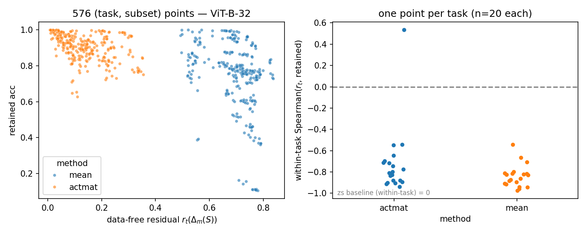

# Report 002 — the data-free residual predicts mergeability per merge instance (Phase 1)

**Question.** Phase 0 (report-001) showed the data-free residual $r_t$ carries the same
*between-task* signal as the zero-shot baseline but doesn't beat it. Its structural
advantage is untested there: $r_t(\Delta_m(S))$ changes with the co-merged subset $S$,
while zs is constant per task. Does $r_t$ predict **which merges** hurt a task —
within-task, across subsets?

**Experiment.** ViT-B-32, the 20 full-FT experts. 36 random subsets (12 each of size
$M \in \{4, 8, 12\}$, seed 0; every task covered 8–20×), each merged once with
{mean, actmat} and evaluated on all member tasks → **576 (task, subset, method)
points** (72 l40s jobs, ~8 min each). For every point, the data-free prediction
$r_t(\Delta_m(S))$ is computed from weights alone (`predict_subset_residuals.py`).

- Target: $\mathrm{ret}_{t,S,m} = \mathrm{acc}_t(\mathrm{merged}_m(S)) / \mathrm{acc}_t(\mathrm{expert}_t)$.
- Statistic: Spearman $\rho_s(r_t, \mathrm{ret})$ — *within-task* (across the subsets
  containing $t$; expected negative) and pooled, vs the static zs baseline.

**Results.**

| | actmat | mean |
|---|---:|---:|
| within-task $\rho_s(r_t, \mathrm{ret})$, mean over 20 tasks | **−0.72** | **−0.84** |
| … median | −0.81 | −0.85 |
| … tasks with $\rho_s < -0.45$ | 19/20 | 20/20 |
| pooled $\rho_s(r_t, \mathrm{ret})$, n=288 | −0.47 | −0.46 |
| pooled $\rho_s(\mathrm{zs}, \mathrm{ret})$ (baseline) | 0.04 | 0.84 |

1. **$r_t$ predicts which merges hurt a task** — within-task $\rho_s \approx -0.8$ for
   both methods; the zs baseline is exactly 0 here by construction. The one outlier
   (PCAM under actmat, +0.53) has nothing to predict: its retention std across subsets
   is 0.024.
2. **For strong merges, $r_t$ is the only working predictor even pooled**: under
   actmat, zs collapses to 0.04 (the paper's effect is gone) while $r_t$ keeps −0.47.
   Under mean-merging zs still wins pooled (0.84) — phase-0 F1 again.
3. **Flattening (phase-0 F2) confirmed at fixed $M$**: retention mean/std at $M=12$ is
   0.88/0.08 (actmat) vs 0.70/0.22 (mean); actmat at $M=12$ retains more than mean at
   $M=4$.

**Takeaway.** Mergeability is not just a property of the task (the paper's view) — it
is a property of the (task, merge) pair, and the data-free covariance residual measures
it: no data, no evals, computed before ever building the merged model. Practical
implications: pre-merge compatibility screening (which experts to co-merge), and a
per-task weighting signal for the merge itself (next: RQ3 intervention).

**Artifacts.** `phase1_manifest.json` (36 subsets), `subsets/ViT-B-32/{method}/*.json`
(ground truth), `phase1_predictions_ViT-B-32.csv`, `phase1_joined_ViT-B-32.csv`,
figure above. Code: `scripts/mergeability/{gen_subsets,eval_subset_merge,
predict_subset_residuals,analyze_phase1,plot_phase1}.py`, driver `eval_subsets.sh`.
